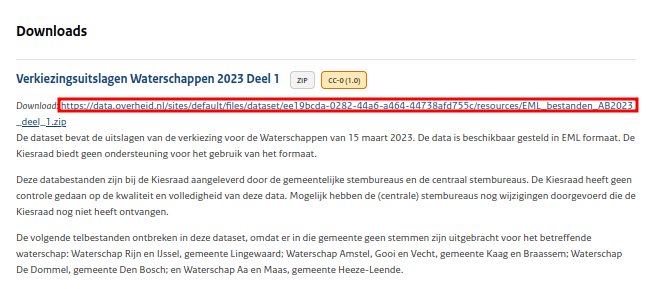

# EmlGet
EmlGet is a Python script that allows users to download election ZIP files [hosted by the electoral council on data.overheid.nl](https://data.overheid.nl/community/organization/kiesraad), unzip them, and structure them in one command. Such functionality is useful for bulk downloads and instant, consistent file structuring 

# Usage
General usage is as follows:
```
$ python emlget.py -h

usage: emlget [-h] [-d DESTINATION_DIR] [-s] base_url

Instantly download and structure EML files from data.overheid.nl.

positional arguments:
  base_url              The base part of the EML ZIP download URL before "_deel_n.zip"

options:
  -h, --help            show this help message and exit
  -d DESTINATION_DIR, --destination_dir DESTINATION_DIR
                        The directory in which the resulting EML files or constituency
                        directories will be stored
  -s, --segregate_dirs  If set, the "EML_bestanden_deel_n" subdirectories will not be
                        merged. 
```
EmlGet's current implementation requires specification of the base URL from which the ZIP files are downloaded. For instance, if you would like to obtain the files from [the AB2023 election data sources page](https://data.overheid.nl/dataset/verkiezingsuitslagen-waterschappen-2023), you could execute the following command:
```
python emlget.py https://data.overheid.nl/sites/default/files/dataset/ee19bcda-0282-44a6-a464-44738afd755c/resources/EML_bestanden_AB2023 -d ab2023
```
The base URL from this example was obtained from the official data source page as shown in the figure below.


